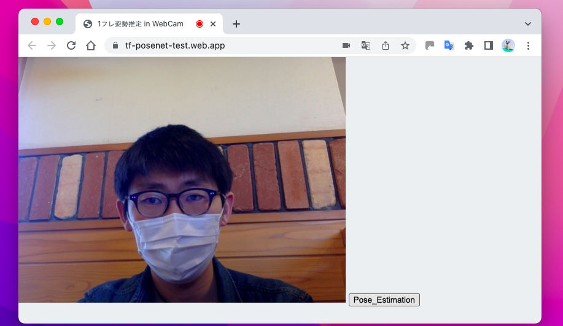
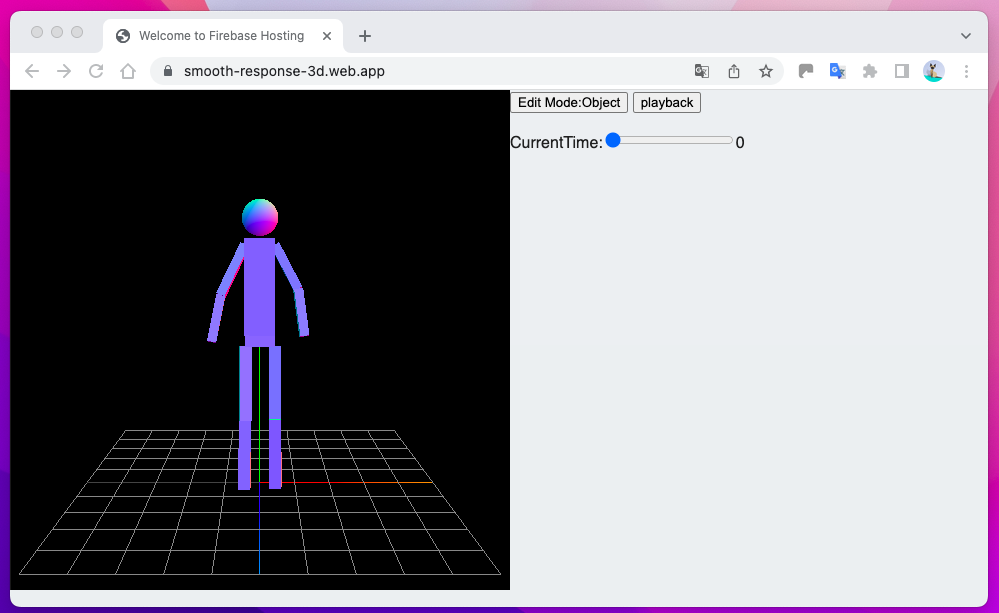

# RemotePracticalInstructionSystem-usingWebBrowser

[Human scale capturing system](https://github.com/b164NK/RemotePracticalInstructionSystem-usingWebBrowser/tree/master/Human%20scale%20capturing%20system)  
・・・姿勢推定による人型抽出システムに関するファイル

[Virtual human model co-editing system](https://github.com/b164NK/RemotePracticalInstructionSystem-usingWebBrowser/tree/master/Virtual%20human%20model%20co-editing%20system)  
・・・仮想人型モデルに対する非同期更新システムに関するファイル 

## 環境構築

上記２つのシステムファイルに加え、サーバーとしてFirebaseを用いて環境構築を行う。
ここでは、「FirebaseHosting」というサービスによってWEBアプリケーションとして公開するまでの手順を述べる。

### 1. Firebaseプロジェクトを作る（要：自身のGoogleアカウント）  

### 2. プロジェクトのホーム画面左側の「プロダクトのカテゴリ」から「FirebaseHosting」を選び、画面に従って進める  
    - FirebaseCLIを自身のPCにインストール(初回のみ)
    - WEBアプリのルートディレクトリは自身のPC内に任意に設定
    - コマンド「firebase init」で作られたルートディレクトリ内のフォルダ「public」に、２つのうち片方ののシステムファイルを置く
    - フォルダ「public」に既に、index.htmlが置かれている場合は消しておく

### 3. 同じく「プロダクトのカテゴリ」から「FirebaseRealtimeDatabase」を選び、画面に従って進める
    - データベースはJSON形式である
    - カラム構成の雛形となるJSONファイル「Pan-Obj-Mot.json」をインポートする

### 4. 2で使わなかった方のシステムファイルを用いて、1~3の手順を再度行う

## 操作方法

ここでは、WEBアプリケーションを実際に用いた、ユーザ操作の手順について述べる。

### [Human scale capturing system](https://github.com/b164NK/RemotePracticalInstructionSystem-usingWebBrowser/tree/master/Human%20scale%20capturing%20system)をHosting(公開)しているサイトをブラウザで開く

    1. WEBカメラを通して、ブラウザ上に全身を映す  
    2. そのまま画面右下の「Pose_Estimation」ボタンを押す  
    3. 変更されたRealtimeDatabaseの内容をexportする
    4. Virtual human model co-editing system　側のRealtimeDatabaseにinportする

### [Virtual human model co-editing system](https://github.com/b164NK/RemotePracticalInstructionSystem-usingWebBrowser/tree/master/Virtual%20human%20model%20co-editing%20system)をHosting(公開)しているサイトをブラウザで開く  

    5. 変更したい動作を見つけ、その動作の時刻に画面右側のシークバーを合わせる
    6. ブラウザ画面上の仮想人型モデルの動かしたい部位をタッチする
    7. ドラッグすることで、任意のポーズになるよう自由に動かす
    8. 動かし終えた際、ドロップする
    
    - 「playback」ボタンを押すことで現在の保存されているアニメーションデータを再生し、実際の動きを確認できる。
    - 「Edit Mode:---」ボタンを押すことで、仮想空間描画中の画面に対する操作を部位操作かカメラワーク操作かで切り替えられる。
     

## 備考

ここで述べたような２つのプロジェクトを用いる方法とは別に、１つのプロジェクト内に2つのWEBシステムをHosting(公開)する方法もある。（参考サイト/[Qiita:Firebase Hostingで複数サイト管理設定](https://qiita.com/zaburo/items/f0fc863d1eb24cfe5cca)）
この方法であれば、同一のRealtimeDatabaseから手動でJSONデータをexport&inportせずとも良いので、ひとまず上記方法で動作が確認を行い、正常に動いた折にはこちらの方法に切り替えて試すのが良いかと思う。

## その他 参考サイト

* iriun Webcam
* Three.js:keyframeanimation system

